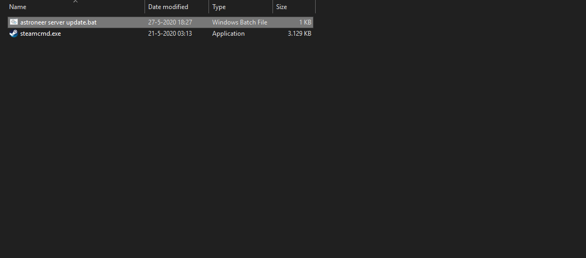
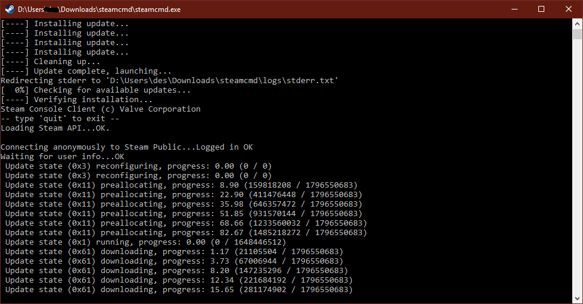
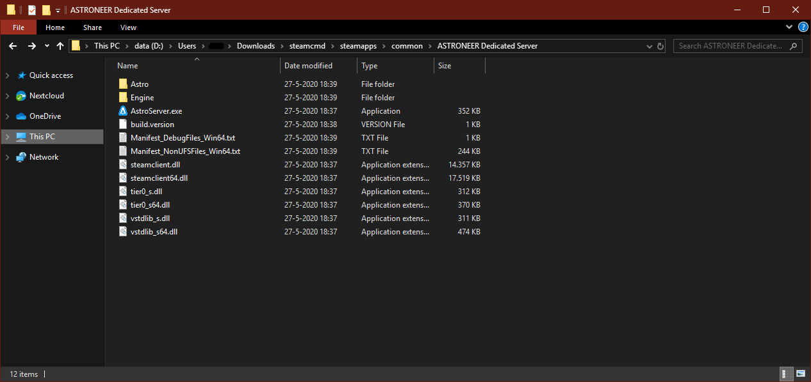
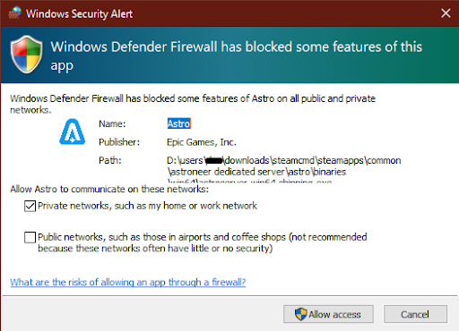
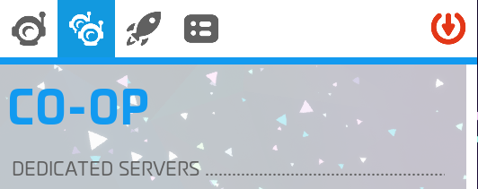
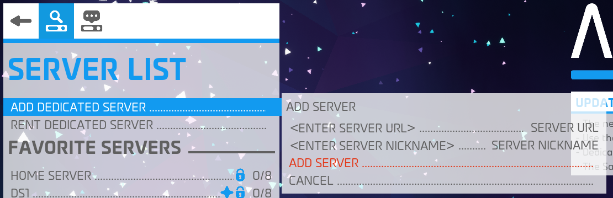
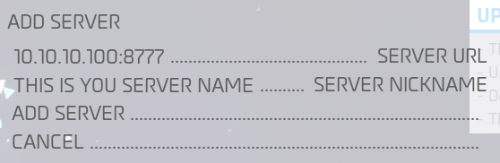
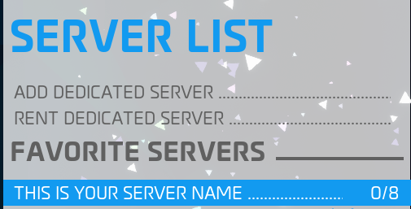
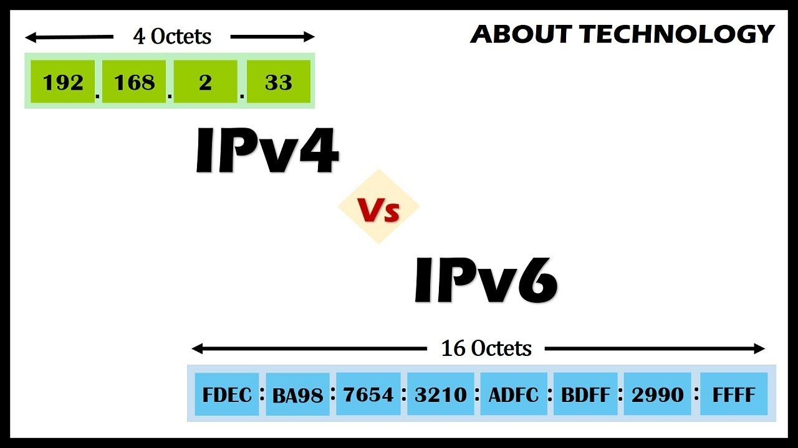
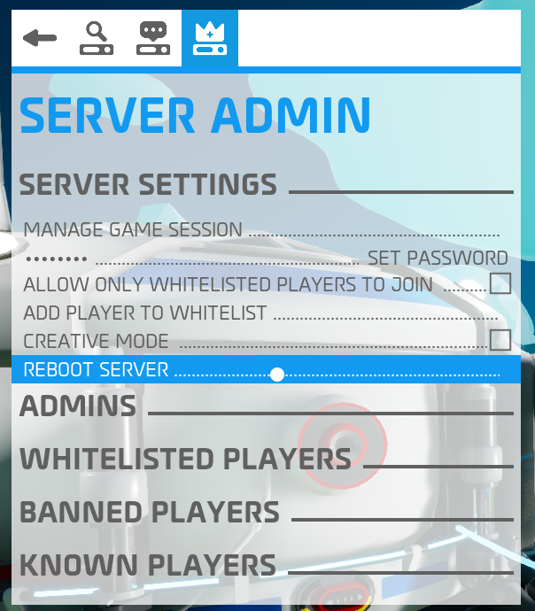

# How to Set Up Your Own Astroneer Dedicated Server

</br>
## Preface#


I am not responsible if you break your computer.  Please, if you don't know what you are doing, stop here.  You are responsible for your actions.  If you proceed, good luck.  There are pictures to help. :-)

</br>
## Overview#

You're here because you want to set up your own Astroneer (self-host) server 
you are going to need some things to make this all work:

- SteamCMD
- A Windows machine, **(Linux/Mac not supported at this time)**
- Some knowledge of how to add a port to your Windows firewall
- Some knowledge of how to add port forwarding to your router a great video to help you out with port forwarding ([Video](https://www.youtube.com/watch?v=CLunOJZqmc0))

</br>
## Instructions

### 1. Download

You will have to download two things: **SteamCMD** and a **`.bat` file** that is going to make it all super easy for you to use. 
- [SteamCMD](https://steamcdn-a.akamaihd.net/client/installer/steamcmd.zip)
- [Astroneer server update.bat](https://drive.google.com/file/d/1RMzIicC0fvxTXr6tO370MzJlF-6_c3re/view?usp=sharing)

After you download the 2 files you place them in an empty folder together like this.

To keep it easy for yourself, call the folder *steamcmd*.


</br>

### 2. Installing the Server

Now you double click on `Astroneer server update.bat`.  It will open a CMD window.  You don’t have to do anything, just wait till everything is downloaded.  The CMD window will close itself after it is done.

The CMD window should look something like this:



When the download is done go to the server folder.  If you are in the *steamcmd* folder you made, the path should be `steamapps\common\ASTRONEER Dedicated Server`.

The folder looks something like this:



Okay, now that we have this part done we will need to configure the server.  There are two configs we have to edit but first, we have to start the server once to create them.  

Double click `AstroServer.exe` to start it.  The server will stop automatically after they have been created.

When you finish editing the config files (see next section), you can run `AstroServer.exe` to start your server.  Additionally, you can download this `.bat` file (place in the same directory) to start your server and it will also restart it if it stops for any reason.

**Note:** Do not close the CMD windows, just minizmize it.

</br>

When you start the server for the first time it may ask you to allow the application through your firewall:



**Note:** If you use a different firewall program, your pop-up will look different.

Next section we will set up the server port and server IP.

### 3. Locate and Modify Dedicated Server `.ini` Files

**WARNING:** Do not modify `.ini` files while the server is running. Changes to the `.ini` while the server is running.  Your changes may be lost.

Once the files are installed above, you will need to modify two server config `.ini` files to enable full functionality.  Navigate to the directory where you installed `steamcmd` and then go into:

```
common\Astroneer Dedicated Server\Astro\Saved\Config\WindowsServer\
```

The two files we will be working with are:
- `Engine.ini`
- `AstroServerSettings.ini`

If they don't exist, try running the server via steam first and then closing it. First up, let’s tackle `Engine.ini`.

</br>
#### `Engine.ini` - Set Connection Port

In `Engine.ini`, you will want to configure the port that the server will accept connections on. You can use a port of your choosing, but for our purposes, we are going to go with Port 8777. 

Add the following lines to `Engine.ini`:

```
[URL]
Port=8777
```

This configures the port that Astroneer will look for connections on.  You will still have to set an exception for your PC's firewall to accept connections on this port.  Please see [this doc](https://www.tomshardware.com/news/how-to-open-firewall-ports-in-windows-10,36451.html) for a great article that explains it in detail on how to do this for Windows 10.  

You will only need to add a rule for UDP.

</br>
#### `AstroServerSettings.ini` - Set Your Public IP Address

**Note:** `AstroServerSettings.ini` should have a few things in it already.  You can use this to modify the settings of the server you are running rather than loading up the entire game to make changes. This only works if the server is offline / not running.

`AstroServerSettings.ini` will need a line that sets the `PublicIP` (public IP) of the server that players will put in-game.  This will need to be updated if your IP changes.  Use a public IP checker like [the one provided by google](https://www.google.com/search?q=my+ip) to figure out yours and then add it to the INI file. Example below, using `10.10.10.100` as the IP:

```
PublicIP=10.10.10.100
```

You can start your server now.  Later, after you get your own server up and running, you might want to make it your own! (next section)

</br>
#### `AstroServerSettings.ini` - Set an Owner

The easiest way to do this is to modify your `AstroServerSettings.ini` with the following lines:

```
OwnerName=yoursteamname
OwnerGuid=0     
```

Replace `yoursteamname` with your actual Steam Account Name.

This will set the first player that connects to the server with the Steam name that is listed in the OwnerName line as the owner of the Server!

You can also set an owner other than yourself by opening the aforementioned `AstroServerSettings.ini`, then deleting the Steam name currently in the owner spot and setting it to the Steam name of the intended owner. The next time they connect it will set them and add a guid id that is unique to them to the ini.

## How to Connect to the Server

Okay, now we are going to connect to the server.  Run **Astroneer**.

As soon as you are in the main menu, go to the **CO-OP** tab.  When you click on that it will show an option named **DEDICATED SERVERS**:



Click on **DEDICATED SERVERS** and it will bring you to this tab:


Now click on **ADD DEDICATED SERVER**, this window will show up:



You should be seeing:

- <ENTER SERVER URL\>
- <ENTER SERVER NICKNAME\>

In <ENTER SERVER URL\> you put your IP you put as your `PublicIP` above and the port you set.  From our example above, that would be: 10.10.10.100:8777

In <ENDER SERVER NICKNAME> put your server name or something to identify it.

You should now see something like this:



Now click on **ADD SERVER**.  It will show up under your **FAVORITE SERVERS** section:



As you can see it does now show up in your **FAVORITE SERVERS** section.  If you did everything right it should show up as 0/8.  If you made a mistake or the server isn't running, you should see something like this:


</br>
##Q&A

Here follows a few answers to common questions.

</br>
#### Can I use a local IP or a DNS (Domain Name System)?

No, right now you can only use a IPv4 you can find yours out by Googling “[my ip](https://www.google.com/search?q=my+ip)”.

**Extra Note:** make sure you use an IPv4 IP as IPv6 is not supported.



</br>
#### Do I have to port-forward my port?

Yes, if you don’t do that it can not communicate to the outside internet.  Meaning you can not see it online even though it is running on your host pc.
Here is a [video to help you out](https://www.youtube.com/watch?v=CLunOJZqmc0) if you have trouble.

</br>
#### My server feels slow can I make it run smoother?

Yes, you can change the server FPS.  By default it is 30FPS as seen here:

```
MaxServerFramerate=30.000000
```

This is in your `AstroServerSettings.ini` file (see above).  For example, if you want to set it to 60FPS, set it to something like this:

```
MaxServerFramerate=60.000000
```

</br>
#### Can I change the autosave and backup interval?

Yes, you can edit this setting in `AstroServerSettings.ini`. (see above)

```
AutoSaveGameInterval=900
BackupSaveGamesInterval=7200
```

As you can see that `AutoSaveGameInterval` is to `900`, which is in seconds, aka 15 minutes.

And `BackupSaveGamesInterval` is at `7200`, also in seconds, aka 120 min.  If you want to change any of the timings just change the numbers.  Keep in mind it is in seconds so 60 means 1 minute.

</br>
#### Do I have to use the provided `.bat` files in this setup guide?

No, you do not.  But they will make your life so much easier to update the server and start the server.  

The bat file that you start your server with also provides an auto-restart if you decide to **REBOOT** (actually just stops) your server with the in-game admin panel or in the event it crashes.  

If you don’t use that bat file you will need to manually run `AstroServer.exe` file to start it up again. 



</br>
#### Can I cross-play on a server that I host myself?

No, you can not do that with personally hosted servers. 

As of this writing, if you want a server that has cross-play you have to buy one from the server hoster [Nitrado](https://server.nitrado.net/eng/offers/Astroneer), they are partnered with [SES](https://systemera.net/).

</br>
## Still have questions?
You can contact the moderators on the [Astroneer Discord](https://discordapp.com/invite/astroneer) and then you can ask for help in `#self-host-talk`.
